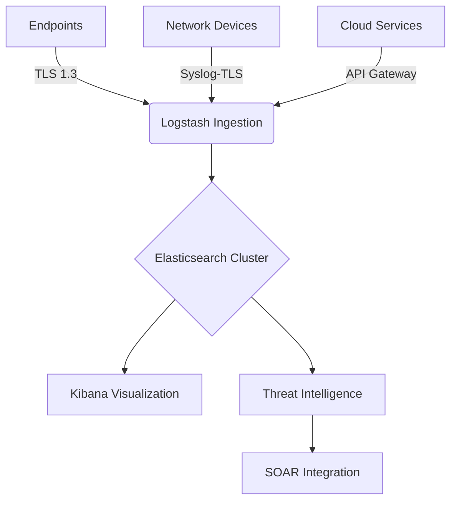

# 🛡️ Enterprise SIEM System

[](https://github.com/example/siem/actions/workflows/ci.yml)
[](LICENSE)
[](releases/latest)
[](documentation/comprehensive_siem_guide.md)
[](graphs/contributors)
[](commits/main)

## Overview
A comprehensive Security Information and Event Management (SIEM) system implementing enterprise-grade security monitoring, threat detection, and compliance management. Built with the Elastic Stack and Sigma rule framework.

## Key Features
✅ Multi-source log collection (Windows, Linux, Network Devices)  
✅ MITRE ATT&CK framework integration  
✅ Real-time threat intelligence enrichment  
✅ UEBA (User and Entity Behavior Analytics)  
✅ Compliance mapping (ISO 27001, NIST, GDPR, PCI DSS)  
✅ Automated response capabilities

## Architecture


## Quick Start
```powershell
# Clone repository
git clone https://github.com/example/siem.git
cd siem

# Deploy configuration
.\deploy.ps1 -Environment Production

# Start services
Start-Service -Name "logstash", "elasticsearch", "kibana"
```

## Documentation
📚 [Comprehensive Implementation Guide](documentation/comprehensive_siem_guide.md)  
📘 [Technical Architecture](documentation/enterprise_architecture.md)  
⚙️ [Detection Rules Reference](detection_rules/)  
📖 [User Manual (EN)](documentation/user_manual_en.md)  
📖 [Benutzerhandbuch (DE)](documentation/user_manual_de.md)  

## Contributing
Please read [CONTRIBUTING.md](CONTRIBUTING.md) for details on our code of conduct and development workflow.

## License
This project is licensed under the MIT License - see [LICENSE](LICENSE) for details.
