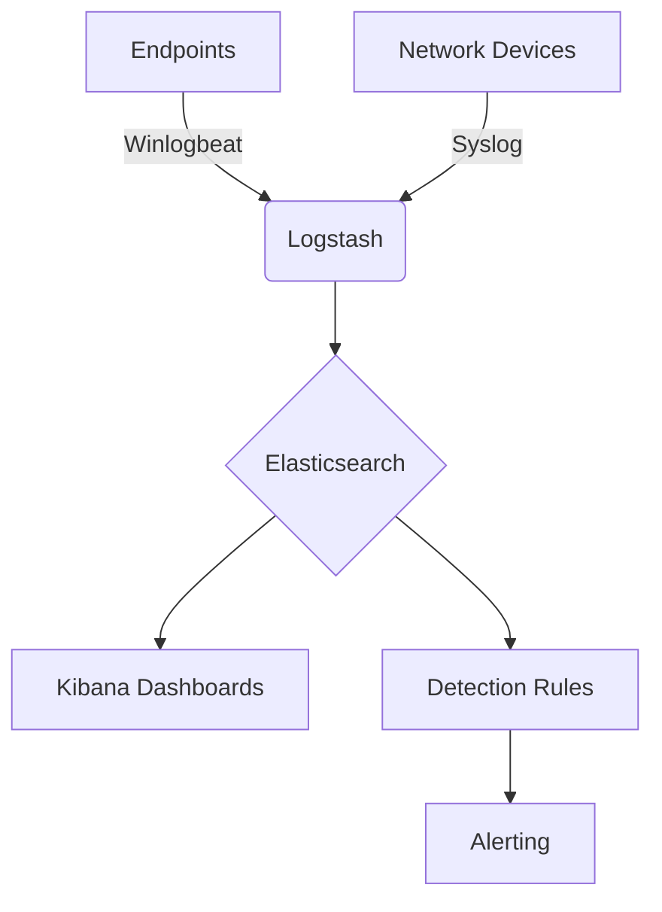

# SIEM System Architecture Documentation

## System Overview
- **Purpose**: Centralized security monitoring and incident detection
- **Components**: ELK Stack (Elasticsearch, Logstash, Kibana) + Sigma rules
- **Data Sources**: Windows Event Logs, Network Devices, Cloud Services

## Data Flow


## Installation Steps
1. **Prerequisites**:
   - Windows/Linux servers
   - Java 11+ runtime
   - 16GB+ RAM recommended

2. **ELK Stack Setup**:
```powershell
# Download Elasticsearch
Invoke-WebRequest -Uri "https://artifacts.elastic.co/downloads/elasticsearch/elasticsearch-8.12.0-windows-x86_64.zip" -OutFile "elasticsearch.zip"
Expand-Archive -Path "elasticsearch.zip" -DestinationPath "C:\Program Files\Elasticsearch"
```

3. **Configuration**:
   - Modify `config/elasticsearch.yml`:
   ```yaml
   cluster.name: siem-cluster
   network.host: 0.0.0.0
   xpack.security.enabled: true
   ```

## Maintenance Procedures
- Daily: Verify log collection status
- Weekly: Review and update detection rules
- Monthly: Performance tuning and storage management
