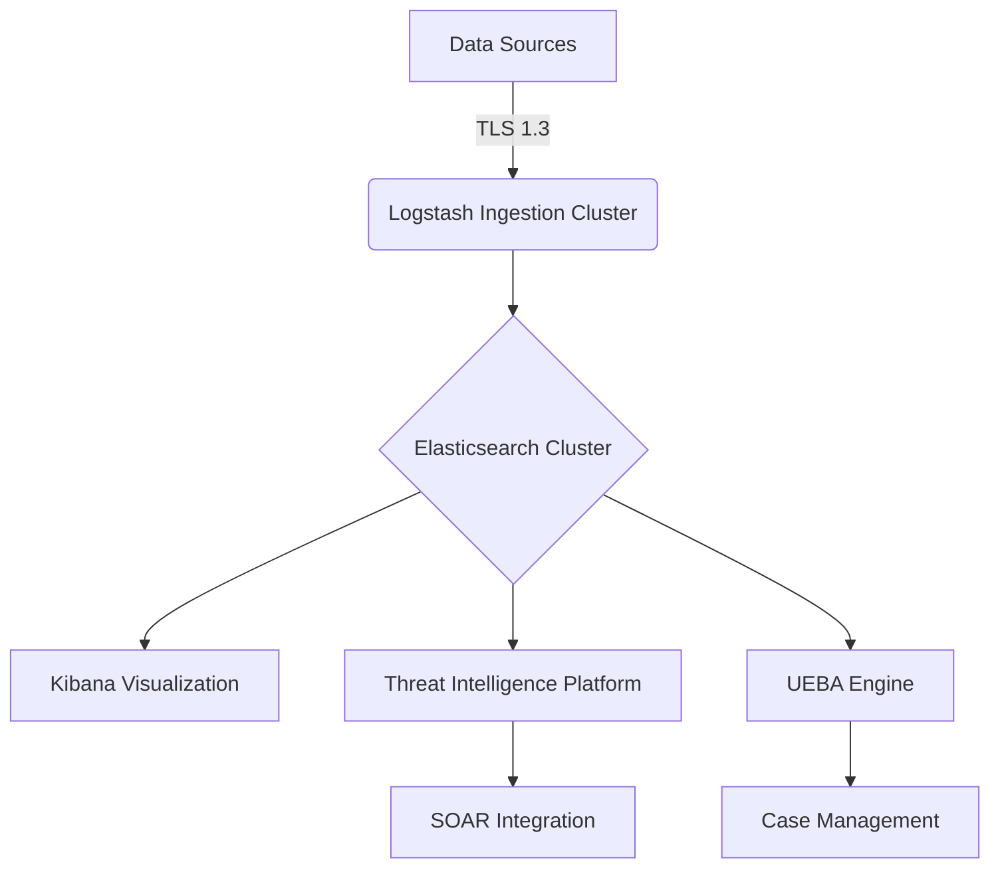
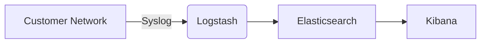
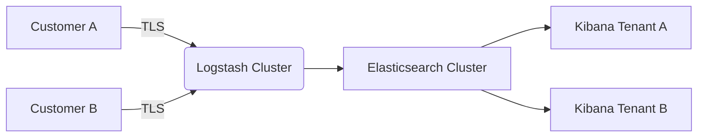

# Enterprise SIEM Implementation and Operations Guide

## Document Control
| Field | Value |
|-------|-------|
| Document Title | Enterprise SIEM Implementation and Operations Guide |
| Version | 1.0 |
| Author | Security Engineering Team |
| Review Date | 2025-08-01 |
| Confidentiality | Internal Use Only |

## Table of Contents
1. Executive Summary
2. Technical Architecture
3. Compliance Framework
4. Implementation Guide
5. Operational Procedures
6. Security Controls
7. Maintenance and Support
8. Appendices

## 1. Executive Summary
This document provides comprehensive guidance for implementing and operating an enterprise-grade Security Information and Event Management (SIEM) system. The system is designed to meet the requirements of ISO 27001, NIST SP 800-53, GDPR, and PCI DSS compliance frameworks.

## 2. Technical Architecture
### 2.1 High-Level Architecture


### 2.2 Component Specification
| Component | Version | Hardware Requirements | Security Features |
|----------|---------|-----------------------|-------------------|
| Logstash | 8.12.0 | 8vCPU, 32GB RAM, 500GB SSD | FIPS 140-2, TLS 1.3 |
| Elasticsearch | 8.12.0 | 16vCPU, 64GB RAM, 4TB NVMe | RBAC, Encryption at Rest |
| Kibana | 8.12.0 | 8vCPU, 16GB RAM, 200GB SSD | SSO Integration |

## 3. Compliance Framework Mapping
### 3.1 ISO 27001 Annex A Controls
| Control | Implementation |
|---------|----------------|
| A.12.4.1 | Log management policy enforced through SIEM |
| A.16.1.1 | Incident management workflow integrated |
| A.6.2.2 | Segregation of duties in access controls |

### 3.2 NIST SP 800-53 Rev. 4 Mapping
| Control | SIEM Implementation |
|---------|---------------------|
| AU-2 | Centralized log collection |
| AU-3 | Content integrity checking |
| AU-6 | Correlation and analysis |

## 4. Implementation Guide
### 4.1 Deployment Scenarios
#### Single-Tenant Architecture


#### Multi-Tenant Architecture


### 4.2 Configuration Management
```powershell
# Example configuration deployment script
$components = @("logstash", "elasticsearch", "kibana")

foreach ($component in $components) {
    Copy-Item -Path "config/$component.conf" -Destination "\\$component-server\config\" -Force
    Restart-Service -Name "$component"
}
```

## 5. Operational Procedures
### 5.1 Daily Operations
1. Verify system health:
```bash
curl -XGET 'https://siem-cluster:9200/_cluster/health?pretty' -H "Authorization: Bearer $API_TOKEN"
```

2. Review detection rules:
```bash
sigma-cli validate detection_rules/
```

### 5.2 Incident Response Workflow
1. Detection → 2. Triage → 3. Enrichment → 4. Response → 5. Documentation

## 6. Security Controls
### 6.1 Access Control Matrix
| Role | Kibana Access | Elasticsearch | Configuration |
|------|---------------|---------------|---------------|
| Analyst | Read-only | Read | None |
| Engineer | Read-write | Read-write | Read |
| Admin | Full | Full | Full |

### 6.2 Cryptographic Controls
- TLS 1.3 with ECDHE-RSA-AES256-GCM-SHA384
- SHA-256 for log integrity
- Hardware Security Module (HSM) integration

## 7. Maintenance and Support
### 7.1 Upgrade Procedure
1. Backup current configuration:
```bash
tar -czvf siem_backup_$(date +%F).tar.gz config/ detection_rules/
```

2. Apply update:
```bash
# Stop services
Stop-Service -Name "logstash", "elasticsearch", "kibana"

# Apply update
msiexec /i siem-update-8.12.1.msi /quiet

# Restart services
Start-Service -Name "elasticsearch", "logstash", "kibana"
```

## 8. Appendices
### A. Detection Rule Template
```yaml
title: [Rule Title]
description: [Rule Description]
status: [production|experimental]
author: [Author Name]
date: YYYY-MM-DD
references:
  - [Reference Links]
logsource:
  product: [windows|linux|network]
  service: [sysmon|security|etc.]
detection:
  selection:
    [Grok Pattern]
  timeframe: [timeframe]
  condition: [condition]
falsepositives:
  - [List]
level: [critical|high|medium|low]
tags:
  - [MITRE ATT&CK ID]
```

### B. Revision History
| Version | Date | Changes | Author |
|--------|------|---------|--------|
| 1.0 | 2025-05-02 | Initial Release | Security Team |
