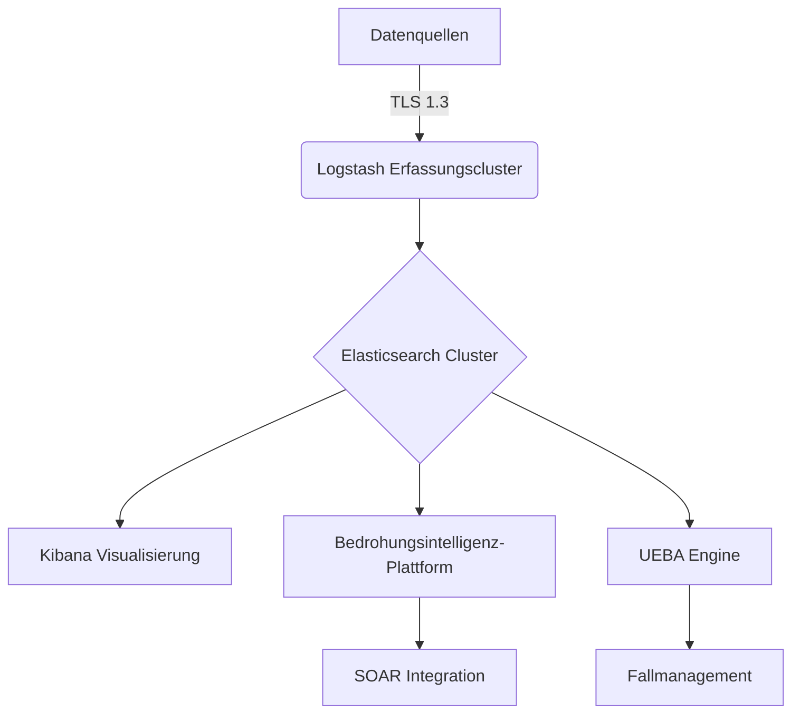
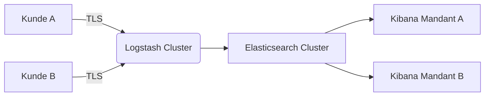

# Enterprise SIEM Implementierungs- und Betriebsleitfaden

## Dokumentenkontrolle
| Feld | Wert |
|-------|-------|
| Dokumententitel | Implementierungs- und Betriebsleitfaden für Enterprise SIEM |
| Version | 1.0 |
| Autor | Security Engineering Team |
| Reviewdatum | 2025-08-01 |
| Vertraulichkeit | Nur für internen Gebrauch |

## Inhaltsverzeichnis
1. Exekutive Zusammenfassung
2. Technische Architektur
3. Compliance-Rahmenwerk
4. Implementierungsleitfaden
5. Betriebsverfahren
6. Sicherheitskontrollen
7. Wartung und Support
8. Anhänge

## 1. Exekutive Zusammenfassung
Dieses Dokument bietet umfassende Anleitung zur Implementierung und zum Betrieb eines Enterprise-grade Security Information and Event Management (SIEM)-Systems. Das System ist darauf ausgelegt, die Anforderungen der Compliance-Rahmenwerke ISO 27001, NIST SP 800-53, GDPR und PCI DSS zu erfüllen.

## 2. Technische Architektur
### 2.1 Hochrangige Architektur


### 2.2 Komponentenspezifikation
| Komponente | Version | Hardware-Anforderungen | Sicherheitsmerkmale |
|----------|---------|-----------------------|-------------------|
| Logstash | 8.12.0 | 8vCPU, 32GB RAM, 500GB SSD | FIPS 140-2, TLS 1.3 |
| Elasticsearch | 8.12.0 | 16vCPU, 64GB RAM, 4TB NVMe | RBAC, Verschlüsselung im Ruhezustand |
| Kibana | 8.12.0 | 8vCPU, 16GB RAM, 200GB SSD | SSO Integration |

## 3. Compliance-Rahmenwerk-Mapping
### 3.1 ISO 27001 Anhang A Kontrollen
| Kontrolle | Implementierung |
|---------|----------------|
| A.12.4.1 | Logmanagement-Richtlinie über SIEM erzwungen |
| A.16.1.1 | Integrierte Incident-Management-Workflow |
| A.6.2.2 | Trennung der Aufgaben in Zugriffssteuerungen |

### 3.2 NIST SP 800-53 Rev. 4 Mapping
| Kontrolle | SIEM Implementierung |
|---------|---------------------|
| AU-2 | Zentrale Log-Erfassung |
| AU-3 | Integritätsprüfung des Inhalts |
| AU-6 | Korrelation und Analyse |

## 4. Implementierungsleitfaden
### 4.1 Bereitstellungsszenarien
#### Einzelmandanten-Architektur


#### Mehrmandanten-Architektur


### 4.2 Konfigurationsmanagement
```powershell
# Beispiel-Konfigurationsskript
$components = @("logstash", "elasticsearch", "kibana")

foreach ($component in $components) {
    Copy-Item -Path "config/$component.conf" -Destination "\\$component-server\config\" -Force
    Restart-Service -Name "$component"
}
```

## 5. Betriebsverfahren
### 5.1 Tägliche Operationen
1. Systemintegrität prüfen:
```bash
curl -XGET 'https://siem-cluster:9200/_cluster/health?pretty' -H "Authorization: Bearer $API_TOKEN"
```

2. Erkennungsregeln überprüfen:
```bash
sigma-cli validate detection_rules/
```

### 5.2 Incident Response Workflow
1. Erkennung → 2. Triage → 3. Anreicherung → 4. Reaktion → 5. Dokumentation

## 6. Sicherheitskontrollen
### 6.1 Zugriffssteuerungsmatrix
| Rolle | Kibana Zugriff | Elasticsearch | Konfiguration |
|------|---------------|---------------|---------------|
| Analyst | Nur-Lesen | Lesen | Keine |
| Engineer | Lesen-Schreiben | Lesen-Schreiben | Lesen |
| Admin | Vollzugriff | Vollzugriff | Vollzugriff |

### 6.2 Kryptografische Kontrollen
- TLS 1.3 mit ECDHE-RSA-AES256-GCM-SHA384
- SHA-256 für Log-Integrität
- Hardware Security Module (HSM) Integration

## 7. Wartung und Support
### 7.1 Update-Prozedur
1. Backup der aktuellen Konfiguration erstellen:
```bash
tar -czvf siem_backup_$(date +%F).tar.gz config/ detection_rules/
```

2. Update anwenden:
```bash
# Dienste stoppen
Stop-Service -Name "logstash", "elasticsearch", "kibana"

# Update installieren
msiexec /i siem-update-8.12.1.msi /quiet

# Dienste neu starten
Start-Service -Name "elasticsearch", "logstash", "kibana"
```

## 8. Anhänge
### A. Erkennungsregel-Vorlage
```yaml
title: [Regel-Titel]
description: [Regel-Beschreibung]
status: [production|experimental]
author: [Autor-Name]
date: YYYY-MM-DD
references:
  - [Referenz-Links]
logsource:
  product: [windows|linux|network]
  service: [sysmon|security|etc.]
detection:
  selection:
    [Grok Pattern]
  timeframe: [zeitraum]
  condition: [bedingung]
falsepositives:
  - [Liste]
level: [critical|high|medium|low]
tags:
  - [MITRE ATT&CK ID]
```

### B. Revisionsverlauf
| Version | Datum | Änderungen | Autor |
|--------|------|---------|--------|
| 1.0 | 2025-05-02 | Erstveröffentlichung | Security Team |
