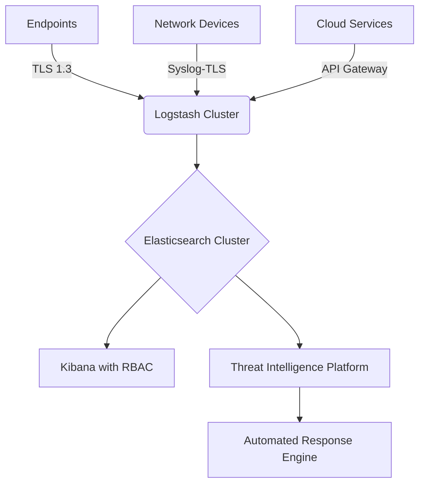

# Enterprise SIEM Implementation Guide

## Security Architecture


## Compliance Integration
- **NIST SP 800-53** controls mapping
- **ISO 27001** Annex A controls
- **GDPR** Article 32 requirements
- **PCI DSS** logging requirements

## Advanced Features
1. **UEBA Integration**:
```yaml
# User Behavior Analytics config
ueba:
  baseline_period: 30d
  risk_scoring:
    login_anomaly: 0.7
    data_access: 0.9
  alert_threshold: 85
```

2. **Threat Intelligence Feed**:
```python
# Threat Intel API integration
def get_ioc_updates():
    ti_providers = [
        "https://otx.alienvault.com/api/v1",
        "https://api.threatconnect.com/v3"
    ]
    return [fetch_iocs(provider) for provider in ti_providers]
```

## Deployment Checklist
1. **Hardware Requirements**:
   - Minimum 3-node cluster
   - 64GB RAM per node
   - NVMe storage (4TB per node)

2. **Security Controls**:
   - FIPS 140-2 validated crypto
   - Hardware Security Modules (HSMs)
   - Network segmentation
