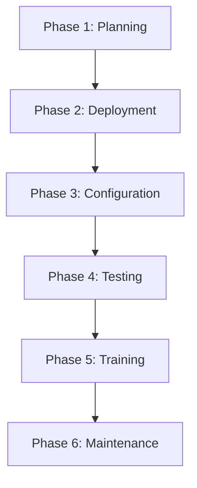
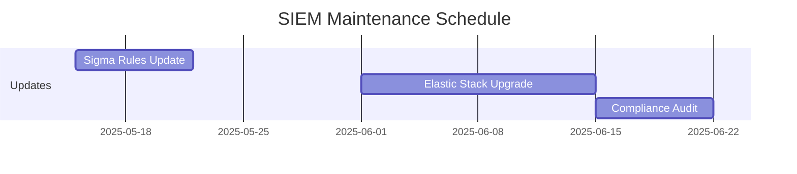

# SIEM System Implementation Plan

## 1. Project Phases


## 2. Phase 1: Planning (Week 1-2)
### 2.1 Requirements Gathering
- [ ] Conduct stakeholder interviews
- [ ] Document compliance requirements (ISO 27001, GDPR, PCI DSS)
- [ ] Identify critical data sources
- [ ] Define use cases:
  - Windows event logs monitoring
  - Network intrusion detection
  - User behavior analysis
  - Compliance reporting

### 2.2 Architecture Design
- [ ] Finalize architecture based on [enterprise_architecture.md]
- [ ] Create network diagram with security zones
- [ ] Define hardware requirements per component:
  ```markdown
  | Component | CPU | RAM | Storage | 
  |----------|-----|-----|---------|
  | Logstash | 8vCPU | 32GB | 500GB SSD |
  | Elasticsearch | 16vCPU | 64GB | 4TB NVMe |
  | Kibana | 8vCPU | 16GB | 200GB SSD |
  ```

## 3. Phase 2: Deployment (Week 3-4)
### 3.1 Core Components Installation
```powershell
# Use existing deployment scripts
cd siem/deployment
.\install-siem.ps1 -Mode Production

# Verify installation
Get-Service -Name "elasticsearch", "logstash", "kibana"
```

### 3.2 Data Source Integration
| Data Source | Integration Method | Port | Protocol |
|-------------|--------------------|------|----------|
| Windows Event Logs | Winlogbeat | 5044 | TCP |
| Network Devices | Syslog | 514 | UDP |
| Firewalls | CEF | 1470 | TCP |
| Applications | REST API | 8080 | HTTPS |

## 4. Phase 3: Configuration (Week 5-6)
### 4.1 Log Processing Configuration
```ruby
# Example logstash configuration (config/logstash.conf)
filter {
  if [type] == "syslog" {
    grok {
      match => { "message" => "<%{POSINT:priority}>%{SYSLOGLINE}" }
    }
    date {
      match => [ "timestamp", "MMM  d HH:mm:ss", "MMM dd HH:mm:ss" ]
    }
  }
}
```

### 4.2 Threat Detection Rules
- [ ] Deploy base Sigma rules:
```bash
cp detection_rules/*.yml /opt/siem/rules/
sigma-cli validate /opt/siem/rules/
```

## 5. Phase 4: Testing (Week 7)
### 5.1 Validation Checklist
- [ ] Verify log ingestion from all sources
- [ ] Test alerting scenarios:
  ```powershell
  # Simulate attack pattern
  for ($i=1; $i -le 10; $i++) {
    eventcreate /ID 4625 /L SECURITY /D "Failed login attempt $i"
  }
  ```

### 5.2 Performance Testing
```bash
# Load test with 10,000 EPS
loggen -c 10000 -i 1 -p 514 syslog-server
```

## 6. Phase 5: Training (Week 8)
### 6.1 Training Materials
- [ ] Create training slides based on [user_manual_en.md]
- [ ] Develop hands-on labs:
  - Dashboard creation
  - Rule tuning
  - Incident investigation

### 6.2 Role-Based Training
| Role | Training Focus | Duration |
|------|----------------|----------|
| Analysts | Threat hunting | 16h |
| Engineers | System tuning | 8h |
| Admins | Maintenance | 8h |

## 7. Phase 6: Maintenance (Ongoing)
### 7.1 Update Schedule


### 7.2 Monitoring Dashboard
- [ ] Create system health dashboard in Kibana
- [ ] Configure alerts for:
  - Disk usage > 80%
  - CPU usage > 90%
  - Log ingestion rate drops

## 8. Risk Management
| Risk | Mitigation | Owner |
|------|------------|-------|
| Data loss | Daily backups | Operations Team |
| False positives | Rule tuning process | Security Team |
| Compliance gaps | Quarterly audits | Compliance Officer |

## 9. Success Criteria
- [ ] 95% log ingestion reliability
- [ ] <5% false positive rate
- [ ] <15 minute alert latency
- [ ] Full compliance with ISO 27001
